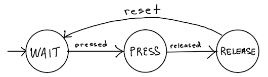

### CSC461 Intelligent Systems
### Project 2 : Intelligent Crosswalk

You will be assigned another person to work with. The code can be identical for the both of you. However, you can also choose different sensors for detecting motion.

Deliverables and Due Dates
- CDIO Due Tuesday, Sep 29 start of class
- Prototype Due Tuesday, Oct 6 start of class

Submit via GitLab

#### Learning Objectives

When finished with this lab, students will be able to:

1. Connect a button to the Metro.
1. In code, determine the status of a button and recognize a press-release.
1. Given a situation, state the advantages and disadvantages of using polling versus a blocking loop.
1. Identify important aspects of engineering an intelligent crosswalk.
1. Create a prototype of an intelligent crosswalk that combines sensor readings, buttons, and blinking LEDs.

<hr>

#### Intelligent Crosswalk

**Real-World Deliverable**: A municipality has identified a location where pedestrians frequently cross that is a high traffic area. They would like you to engineer an intelligent system that monitors both vehicle traffic and pedestrians to control a crosswalk light that will make it safer for pedestrians. There is a button that pedestrians can press to control the light for crossing. The light should continuously flash yellow to alert cars until the pedestrian(s) are safely across. Once cars are stopped, another light will turn on to let pedestrians know it is safe to cross. Once there are no pedestrians in the walkway, the lights will turn off and traffic can resume.

**Prototype Deliverable**: Using the Metro, buttons (i.e. switches), and a distance sensor, create a system that will monitor buttons, detect movement across an area, and control LEDs based on button state and detected motion.

Specifically, consider 2 systems on each side of a "road." The flow of states is as follows:

On-board LED: traffic light
Breadboard LED: pedestrian light

1. A button is pressed on one side of the road.
2. Start blinking the on-board led at 2 Hz (that's 4 toggles) to tell traffic to stop. 
3. Wait 5 seconds while flashing the traffic LED.
4. Turn on a breadboard LED (solid) to let pedestrian traffic cross AND continue flashing the traffic LED.
5. Actively check for motion on other side of road. 
6. When motion sensed (i.e. person has crossed the street), turn the breadboard (pedestrian) LED off, but keep flashing the traffic LED.
7. Wait for 5 seconds, then turn the on-board LED off. 

You can create 2 systems that monitor the 2 sides of the road. They cannot talk to each other (which of course is not ideal). They should not interfere with each other's operation. We will assume that pedestrian traffic comes from only one side at a time and there is only one person at a time who completes the crossing before another one appears (this is very terrible assumption for a crosswalk!, but that is what we are doing).

#### Conceive - Design - Implement - Operate (CDIO) Learning Framework

With your partner, complete the CDIO framework for this project. On Google:

https://docs.google.com/document/d/1XRQfhJ0z-954dRxPkF9CPSxahgAHy3WKoSSBqKFh3tY/edit?usp=sharing

<hr>

#### Connecting a Button (i.e. switch)

A button is a form of digital input that we read as "pressed" or "released". You can use one of the GPIO's, set it as input, and read the status using a bitmask with PINx. There are a couple of tricky things about buttons. 

1. When you set it up, you have to enable the pull-up resistor. This allows it to have a state, when there is not any current flowing through. If you want to know more, ask AI "Why do you need a pullup resistor with a button/switch?"

2. The signal can "bounce" -- as you press the button, the signal might change a couple of times (Low-High-Low) before it settles. 

3. Buttons can be configured to be closed when pressed or open when pressed. This means that depending on how you wire it, it might read as HIGH or LOW when pressed. You have to test it out, if you do not have the datasheet to check.

4. You typically want to know when a button has been pressed then released, not when it is first pressed. This requires you to track state changes of the button.

5. You have to read the status of the button at the time it is being pressed. The state is not saved, so you can miss a button press-release if you are not checking frequently enough.

Here are some directions for connecting a button: https://docs.arduino.cc/tutorials/generic/digital-input-pullup/

#### Polling, Blocking Loop, and Interrupts

There are different ways to interface with a device. Each has its place.

- Blocking Loop: wait until the device responds, not doing anything else.
- Polling: periodically poll (check) the device for a response.
- Interrupts: set up the hardware to respond to the device when it signals, thereby interrupting the cpu.

**Copy the worksheet so that you can edit it. At the end of class, you can print a copy and turn it in.**

> Do a little research and answer question #1 on the worksheet.

https://docs.google.com/document/d/1duvxx7sKKPYnyRmG40upC8GLMvb92-0iNF-fRQUgxnM/edit?usp=drive_link

#### Implementing the Button 

First, wire up the button and use the code in the above Arduino link to output the status of the button to confirm it is working correctly.

> Answer the corresponding questions on the worksheet.

**Create an Arduino sketch button\_test**

Second, in the Arduino sketch folder, create a header and source file that manages the button (called button.h and button.c). In the header, define the appropriate port and pin for the button; declare a function to initialize the button port/pin; and declare the function `int check_status()` that will return the current status of the button. Define those functions in button.c. You will add to this file later to determine when the button has been pressed then released.

Third, in the button\_test Arduino sketch, initialize the on-board LED and the button (by calling the function in button.c). In the loop, blink the LED at 2 Hz (that is 4 toggles) and poll for a button state at 10 Hz. Whenever the state of the button changes from released to pressed, turn the LED off. Whenever the state of the button changes from pressed to released, resume blinking the LED.

> Answer the corresponding questions on the worksheet.

The Arduino code initializes the button as input and enables the pullup resistor. In your button.h file, you need to do the same.

- CLEAR the appropriate pin in the DDRx to initialize as input
- SET the same pin in the PORTx to enable the pullup resistor on that pin

As a reminder, it is super helpful to use your #defines to define the registers that correspond to the port and pin that you are using on the board. This allows you to easily connect to a different pin and change the code in one place.

#### Button State Machine

In your files to implement the button, add state machine code that manages three states: wait, press, release, depicted below. 



The state machine is implemented in the check\_status() function with help from a reset function. 

- Use #define's to define states WAIT, PRESS, RELEASE as 0, 1, and 2.
- Return one of these states from the `check_status` function.
- Create a function reset() that will set a variable to "true" -- C does not have booleans. Traditionally, 0 is false and 1 is true.
- Use if-statements for the state machine, like this algorithm ...

```
STATE MACHINE ALGORITHM

check status of button

if WAIT==state && button pressed:
	delay for 10 ms to cover bounce
	change state to PRESS
else if PRESS==state && button released:
	delay for 10 ms
	change state to RELEASE
else if RELEASE==state && reset:
	reset = false
	change state to WAIT
else
	something is not right, should not be here
```

#### Complete the Prototype

Create a new sketch crosswalk.ino. Copy your button code and your ultrasonic sensor code into this folder. For now, you can use the ultrasonic sensor as your pedestrian motion sensor.

Now that you have all the pieces, create an intelligent crosswalk prototype that uses LEDs to signal vehicles to stop and pedestrians to cross. It uses a button for pedestrians to indicate they want to cross, and it uses motion detection to determine when the pedestrian has finished crossing the street.

_In this folder there is an example of leds.c and a readme about creating an leds.h. This is optional, so you decide if you have the interest and time to implement it._


